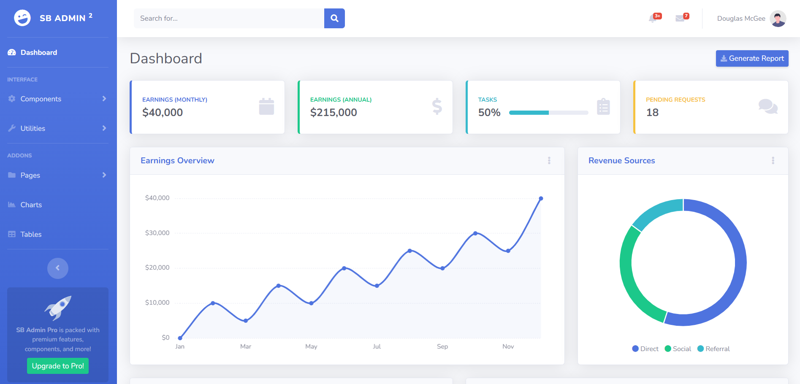

# startbootstrap-sb-admin-2-gh-pages
Admin Panel


# Project Name

[](LICENSE)
[](#)
[](#)

One-line project description explaining what this project does and why it exists.

---

## Screenshot



*A short caption for the image above.*

---

## Features

- Feature 1 — short description
- Feature 2 — short description
- Feature 3 — short description

---

## Installation

```bash
# clone the repo
git clone https://github.com/your-username/your-repo.git
cd your-repo

# install dependencies (example)
npm install
